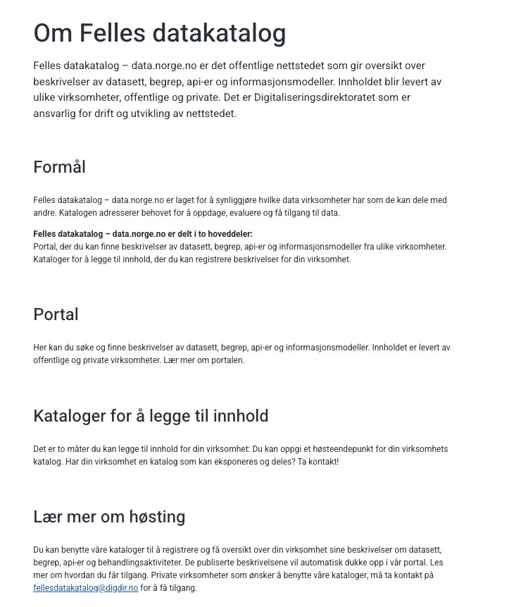

# Om Felles Datakatalog

Felles datakatalog – data.norge.no er det offentlige nettstedet som gir oversikt over beskrivelser av datasett, begrep, api-er og informasjonsmodeller. Innholdet blir levert av ulike virksomheter, offentlige og private. Det er Digitaliseringsdirektoratet som er ansvarlig for drift og utvikling av nettstedet.

## Formål

Felles datakatalog – data.norge.no er laget for å synliggjøre hvilke data virksomheter har som de kan dele med andre. Katalogen adresserer behovet for å oppdage, evaluere og få tilgang til data.

## Felles datakatalog – data.norge.no er delt i to hoveddeler:

Portal, der du kan finne beskrivelser av datasett, begrep, API-er og informasjonsmodeller fra ulike virksomheter.
Kataloger for å legge til innhold, der du kan registrere beskrivelser for din virksomhet.

## Portal

Her kan du søke og finne beskrivelser av datasett, begrep, API-er og informasjonsmodeller. Innholdet er levert av offentlige og private virksomheter.

## Kataloger for å legge til innhold

Det er to måter du kan legge til innhold for din virksomhet:

1. Du kan oppgi et[ høsteendepunkt](https://data.norge.no/publishing/about-harvesting) for din virksomhets katalog.
2. Du kan [registrere](https://data.norge.no/publishing/about-registration) innhold i interne kataloger for din virksomhet.

## Lær mer om høsting

Du kan benytte våre kataloger til å registrere og få oversikt over din virksomhet sine beskrivelser om datasett, begrep, api-er og behandlingsaktiviteter. De publiserte beskrivelsene vil automatisk dukke opp i vår portal. Les mer om hvordan du får tilgang. Private virksomheter som ønsker å benytte våre kataloger, må ta kontakt på fellesdatakatalog@digdir.no for å få tilgang.

## Vil du vite mer?

Vi har en egen [side for dokumentasjon for våre løsninger på Github](https://informasjonsforvaltning.github.io/). Besøk gjerne siden for mer informasjon om Felles datakatalog.

