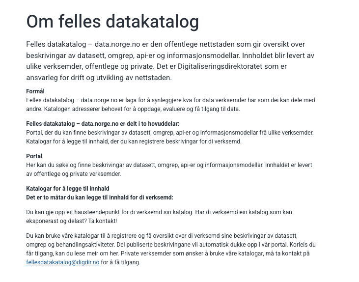

#### Formål

Felles datakatalog – data.norge.no er laga for å synleggjere kva for data verksemder har som dei kan dele med andre. Katalogen adresserer behovet for å oppdage, evaluere og få tilgang til data.

**Felles datakatalog – data.norge.no er delt i to hovuddelar:**

Portal, der du kan finne beskrivingar av datasett, omgrep, api-er og informasjonsmodellar frå ulike verksemder.
Katalogar for å legge til innhald, der du kan registrere beskrivingar for di verksemd.

#### Portal

Her kan du søke og finne beskrivingar av datasett, omgrep, api-er og informasjonsmodellar. Innhaldet er levert av offentlege og private verksemder.

#### Katalogar for å legge til innhald

**Det er to måtar du kan legge til innhald for di verksemd:**

Du kan gje opp eit hausteendepunkt for di verksemd sin katalog. Har di verksemd ein katalog som kan eksponerast og delast? Ta kontakt!

Du kan bruke våre katalogar til å registrere og få oversikt over di verksemd sine beskrivingar av datasett, omgrep og behandlingsaktiviteter. Dei publiserte beskrivingane vil automatisk dukke opp i vår portal. Korleis du får tilgang, kan du lese meir om her. Private verksemder som ønsker å bruke våre katalogar, må ta kontakt på fellesdatakatalog@digdir.no for å få tilgang.

## Vil du vita meir?

Vi har ein eigen [side for dokumentasjon for våre løsninger på Github](https://informasjonsforvaltning.github.io/). Besøk gjerne sida for meir informasjon om Felles datakatalog.

