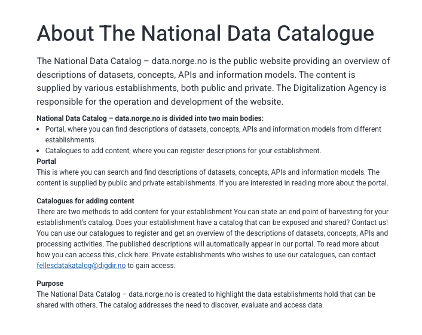

## National Data Catalog – data.norge.no is divided into two main bodies:

- Portal, where you can find descriptions of datasets, concepts, APIs and information models from different establishments.
- Catalogs to add content, where you can register descriptions for your establishment.

## Portal

This is where you can search and find descriptions of datasets, concepts, APIs and information models. The content is supplied by public and private establishments. If you are interested in reading more about the portal.

## Catalogs for adding content

There are two methods to add content for your establishment
You can state an end point of harvesting for your establishment’s catalog. Does your establishment have a catalog that can be exposed and shared? Contact us!
You can use our catalogs to register and get an overview of the descriptions of datasets, concepts, APIs and processing activities. The published descriptions will automatically appear in our portal. To read more about how you can access this, click here. Private establishments who wishes to use our catalogues, can contact fellesdatakatalog@digdir.no to gain access.

## Purpose

The National Data Catalog – data.norge.no is created to highlight the data establishments hold that can be shared with others. The catalog addresses the need to discover, evaluate and access data.

