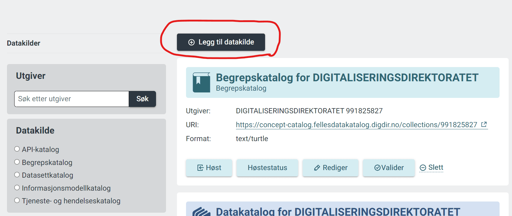
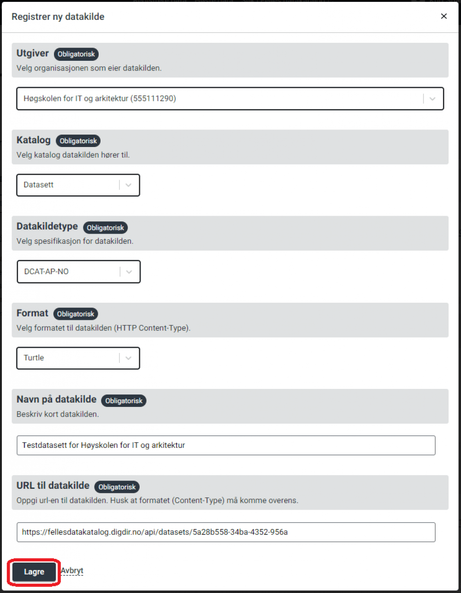

# Hvordan publisere beskrivelser

Har du brukt registreringsløsningen til å lage beskrivelser, og publisert dem derifra, blir katalogen automatisk lagt til for høsting. Ønsker du å starte en høsting av beskrivelsene dine manuelt, gjør du det fra [administrasjons-grensesnittet for høsting](https://admin.fellesdatakatalog.digdir.no/data-sources).

[Hvordan starte høsting](TODO:lenke-til-beskrivelse-av-høstetrigging)

## Sette opp høsting: Registrere høsteendepunkt

Forvalter du beskrivelsene selv og vil publisere til Data.norge.no, må du sette opp høsting i [administrasjons-grensesnittet](https://admin.fellesdatakatalog.digdir.no/data-sources). Det gjør du slik:

**Før du kan sette opp høsting av en ny katalog:**

- Høsteendepunktet som tjener beskrivelsene som må være tilgjengelig på nettet (eventuelt sikret med en API-nøkkel).
- Dataen som returneres må være i et av [formatene Data.norge.no støtter]().
- Dataen må være beskrevet i henhold til den aktuelle spesifikasjonen. Les mer om [hvordan lage beskrivelser]().
- Du må ha de nødvendige tilgangene for å bruke løsningen. Les mer om [hvordan få tilgang]().

### Steg 1: Logg inn

Logg inn i [admin-grensesnittet for høsting](https://admin.fellesdatakatalog.digdir.no/data-sources)

### Steg 2: legg til datakilde

Klikk på knappen «Legg til datakilde».

Merk: du må legge til en datakilde for hver ressurstype (datasett, begrep, tjeneste osv.) du ønsker å høste.

### Steg 3: Fyll ut skjemaet

Fyll ut alle de obligatoriske feltene i skjemaet.

Det valgte formatet må samsvare med RDF-formatet beskrivelsen er i.

"Navn på datakilde" brukes kun i oversiktsvisningen i administrasjonsgrensesnittet og vises ingen andre steder.

Klikk på knappen «Lagre». Den nye datakilden skal nå vises i administrasjonsløsningen.

Data.norge.no vil nå høste fra kilden regelmessig og fange opp endringer.

Les mer om hvordan [starte en høsting manuelt]().
