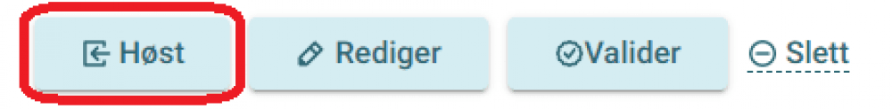

# Hvordan publisere beskrivelser

Har du brukt registreringsløsningen til å lage beskrivelser, blir katalogen automatisk lagt til for høsting. Ønsker du å trigge høsting manuelt, gjøres dette fra [admin-grensesnittet for høsting](https://admin.fellesdatakatalog.digdir.no/data-sources).

Hvis du ikke har brukt registreringsløsningen, må høsteendepunktet registreres manuelt. Slik gjør du det:

## Registrere høsteendepunkt manuelt

**Før du begynner:** Sørg for at høsteendepunktet ditt er skrevet i et format som håndteres av RDF, og at du har de nødvendige tilgangene. Les mer om [hvordan skrive databeskrivelser]() og [hvordan få tilgang]().

### Steg 1: Logg inn og legg til datakilde

Logg inn i [admin-grensesnittet for høsting](https://admin.fellesdatakatalog.digdir.no/data-sources) og klikk på knappen «Legg til datakilde».

### Steg 2: Fyll ut skjemaet

Fyll ut minst alle de obligatoriske feltene i skjemaet.

Klikk på knappen «Lagre». Den nye datakilden skal nå vises i administrasjonsløsningen.

### Steg 3: Start høsting

Klikk på knappen «Høst».

En melding vises om at høsteforespørselen er sendt.

Det kan ta noe tid, avhengig av størrelsen på katalogen din, før resultatet blir publisert og kan sees på [data.norge.no](https://data.norge.no).

Takk for at du deler data!
