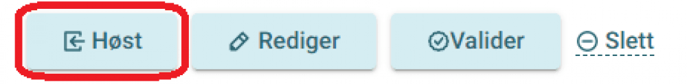
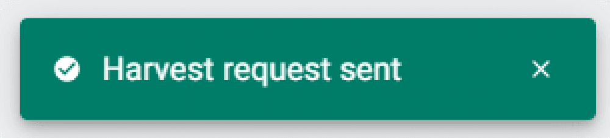

### Steg 1: Logg inn

Logg inn i [admin-grensesnittet for høsting](https://admin.fellesdatakatalog.digdir.no/data-sources)

### Steg 2: Velg datakilde

Finn den datakilden du ønsker å starte høsting av.

### Steg 3: Start høsting

Klikk på knappen «Høst».

En melding vises om at høsteforespørselen er sendt.

Det kan ta noe tid, avhengig av størrelsen på katalogen din, før resultatet blir publisert og kan sees på [data.norge.no](https://data.norge.no).

Takk for at du deler data!
